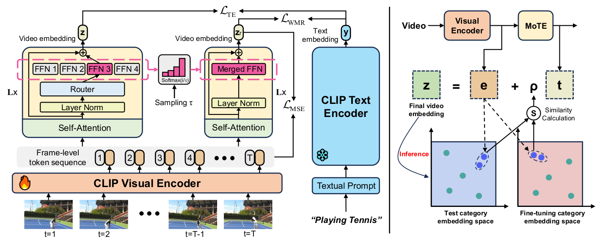

<h2> [NeurIPS'2024] MoTE: Reconciling Generalization with Specialization for Visual-Language to Video Knowledge Transfer </h2>

[](https://nips.cc/Conferences/2024)

[]()

</div>

## Overview

Official implementation of our  **MoTE**, an effective Visual-Language to video knowledge transfer framework that enjoys both superior generalization and specialization, striking an optimal trade-off between close-set and zero-shot performance in one unified model.




## :mailbox_with_mail:Requirements


- PyTorch (2.0.1 recommended)
- RandAugment
- pprint
- tqdm
- dotmap
- yaml
- csv
- decord

## :link: Data Preparation

#### Dataset

- For downloading the Kinetics-400&600 datasets, you can refer to [mmaction2](https://github.com/open-mmlab/mmaction2/blob/master/tools/data/kinetics/README.md) or [CVDF](https://github.com/cvdfoundation/kinetics-dataset). 
- For [UCF-101](https://www.crcv.ucf.edu/data/UCF101.php) and [HMDB-51](https://serre-lab.clps.brown.edu/resource/hmdb-a-large-human-motion-database/), you can  get them from the official website.
- We rescale all videos to height=256 pixels, it is not necessary, but it will save a lot of memory storage space and fast IO speed.

#### Video Loader

By default, we decode the videos on the fly using [decord](https://github.com/dmlc/decord). 

<details><summary>Example of annotation</summary>


```sh
  abseiling/aaa.mp4 0
  abseiling/bbb.mp4 0
```

</details>

(Optional) We can also extract videos into frames for fast reading. Please refer to [BIKE](https://github.com/whwu95/BIKE/blob/main/README.md) repo for the detaied steps.


## :cat: Model Zoo

We train one unified model for both close-set and zero-shot video recognition tasks. The corresponding results, models, and configs are listed in the table below.

### Close-set performance (Kinetics-400)

| Architecture | Input  | Views | Top-1(%) | Top-5(%) | checkpoint |                         config                          |
| :----------: | :----: | :---: | :------: | :------: | :--------: | :-----------------------------------------------------: |
|   ViT-B/16   | 8x224  |  1x1  |   81.8   |   95.9   |            | [config](configs/k400/k400_train_video_vitb-16-f8.yaml) |
|   ViT-B/16   | 8x224  |  4x3  |   83.0   |   96.3   |            | [config](configs/k400/k400_train_video_vitb-16-f8.yaml) |
|   ViT-L/14   | 8x224  |  4x3  |   86.8   |   97.5   |            | [config](configs/k400/k400_train_video_vitl-14-f8.yaml) |
|   ViT-L/14   | 16x224 |  4x3  |   87.2   |   97.7   |            |                            -                            |

### Zero-shot performance (UCF-101 & HMDB-51 & k600)

| Architecture | Input | Views | UCF-101 | HMDB-51 | Kinetics-600 | config|
|:------------:|:-------------------:|:------------------:|:-----------------:|:--------------:|:--------------:|:--------------:|
| ViT-B/16 | 8x224 | 3x1 | 83.4 | 55.8 | 70.2 | [UCF](configs/ucf101/ucf_split1.yaml)/[HMDB](configs/hmdb51/hmdb_split1.yaml)/[K600](configs/k600/k600_zs_test_split1.yaml) |
|   ViT-L/14   | 8x224 |  3x1  |  88.7   |  61.4   |     78.4     | [UCF](configs/ucf101/ucf_split1.yaml)/[HMDB](configs/hmdb51/hmdb_split1.yaml)/[K600](configs/k600/k600_zs_test_split1.yaml) |


## :speedboat:Training
By default , we train our model on Kinetics-400 with 3 GPUs in a *Single Machine*.

```bash
# We train the ViT-L/14 model using 6 layers of MoTE, with 4 temporal experts per layer.
bash scripts/run_train.sh configs/k400/k400_train_video_vitl-14-f8.yaml
```


## :ocean:Testing
**Close-set evaluation.** We adopt single-view (1 x 1 views)  or multi-view (4 x 3 views)  evaluation protocol with 8 frames per view.

```bash
# Single-view evaluation
bash scripts/run_test.sh k400_train_video_vitl-14-f8.yaml MoTE_L14.pt

# Multi-view evaluation
bash scripts/run_test.sh k400_train_video_vitl-14-f8.yaml MoTE_L14.pt --test_clips 4 --test_crops 3  
```

**Zero-shot evaluation.** We use 3 x 1 views for evaluation with 8 frames per view.


```bash
# UCF-101
bash scripts/run_test_zeroshot.sh configs/ucf101/ucf_split1.yaml MoTE_L14.pt --test_clips 3

# HMDB-51
bash scripts/run_test_zeroshot.sh configs/hmdb51/hmdb_split1.yaml MoTE_L14.pt --test_clips 3

# Kinetics-600
bash scripts/run_test_zeroshot.sh configs/k600/k600_zs_test_split1.yaml MoTE_L14.pt --test_clips 3
```


## 📌 BibTeX & Citation

 If our work is useful to you, please consider citing our paper using the following BibTeX entry.


```bibtex

```

## :memo: Acknowledgement

Our code builds on [BIKE](https://github.com/whwu95/BIKE) and [CLIP](https://github.com/openai/CLIP). Thank them for their excellent works!
